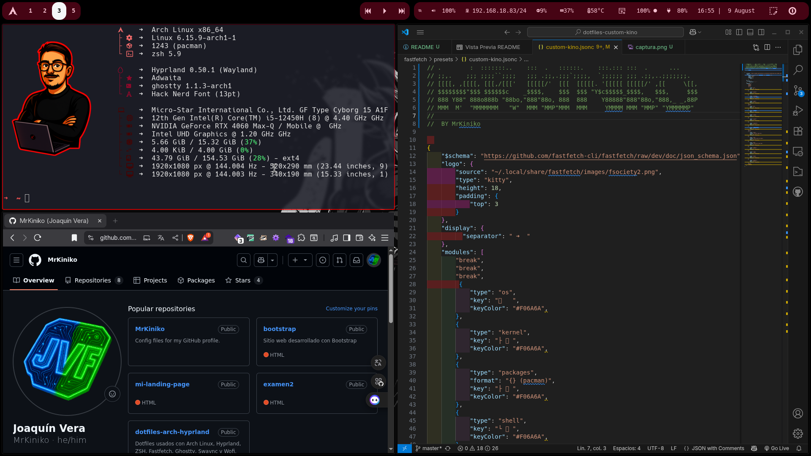

# Dotfiles Arch + Hyprland

Dotfiles usados con Arch Linux, Hyprland, ZSH, Fastfetch, Ghostty, Swaync y Wofi.
Estos dotfiles han sido editados del proyecto https://github.com/luismendozamx/dotfiles, yo simplemente los he adaptado a mis gustos y necesidades.
## Capturas

